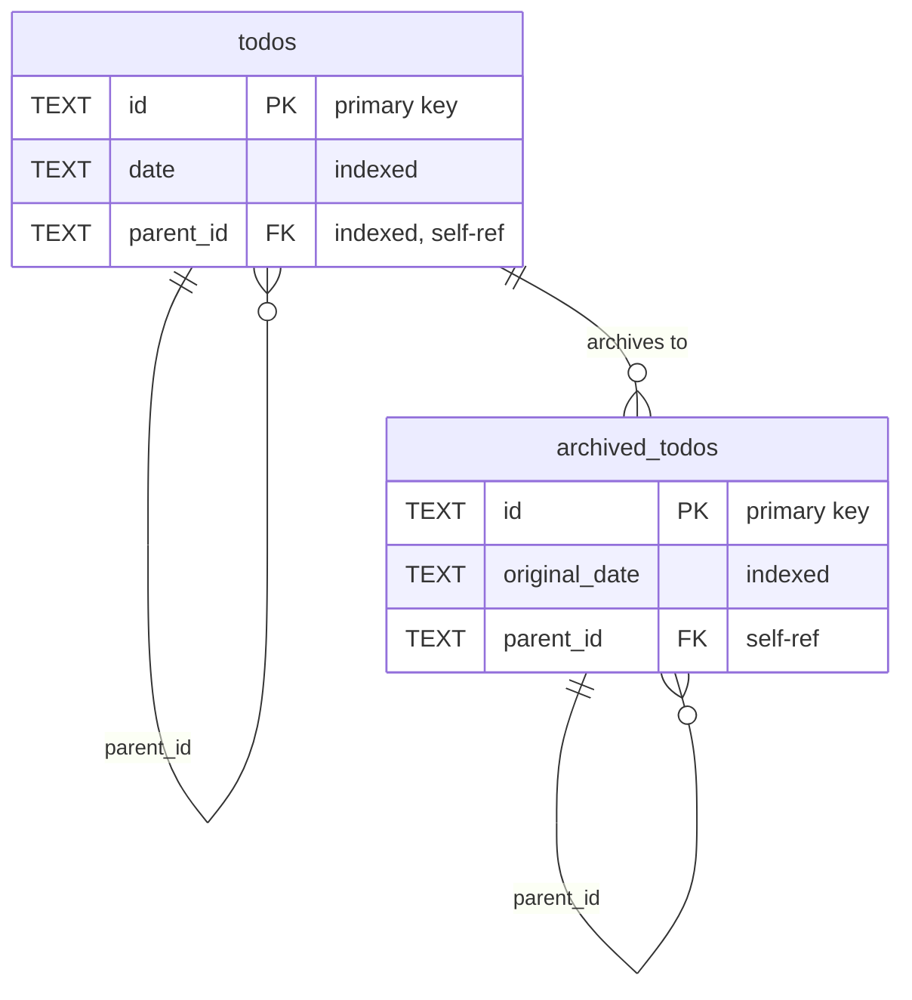
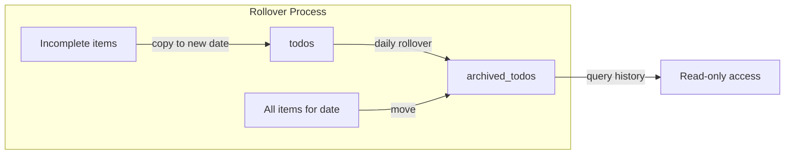

# Database Design

SQLite database stored at `~/.todo-cli/todos.db`

## Entity Relationship Diagram

## Tables

### `todos`

Active todo items organized by date.

| Column | Type | Constraints | Description |
|--------|------|-------------|-------------|
| `id` | TEXT | PRIMARY KEY | UUID v4 identifier |
| `date` | TEXT | NOT NULL | Date in YYYY-MM-DD format |
| `content` | TEXT | NOT NULL | Todo item text |
| `state` | TEXT | NOT NULL | One of: ` ` (empty), `x` (done), `?` (question), `!` (important) |
| `indent_level` | INTEGER | NOT NULL | Nesting depth (0 = top level) |
| `parent_id` | TEXT | nullable | UUID of parent todo (self-referencing FK) |
| `due_date` | TEXT | nullable | Due date in YYYY-MM-DD format |
| `description` | TEXT | nullable | Additional notes/description |
| `collapsed` | INTEGER | NOT NULL DEFAULT 0 | Whether children are hidden (0=expanded, 1=collapsed) |
| `position` | INTEGER | NOT NULL | Display order within the date |
| `created_at` | TEXT | NOT NULL | Creation timestamp (RFC3339) |
| `updated_at` | TEXT | NOT NULL | Last modification timestamp (RFC3339) |
| `completed_at` | TEXT | nullable | When state changed to `x` (RFC3339) |
| `deleted_at` | TEXT | nullable | Soft delete timestamp (RFC3339) |

### `archived_todos`

Historical todo items moved from `todos` during daily rollover.

| Column | Type | Constraints | Description |
|--------|------|-------------|-------------|
| `id` | TEXT | PRIMARY KEY | Original UUID from todos table |
| `original_date` | TEXT | NOT NULL | Original date in YYYY-MM-DD format |
| `archived_at` | TEXT | NOT NULL | When item was archived (RFC3339) |
| `content` | TEXT | NOT NULL | Todo item text |
| `state` | TEXT | NOT NULL | Final state when archived |
| `indent_level` | INTEGER | NOT NULL | Nesting depth |
| `parent_id` | TEXT | nullable | UUID of parent todo |
| `due_date` | TEXT | nullable | Due date in YYYY-MM-DD format |
| `description` | TEXT | nullable | Additional notes/description |
| `collapsed` | INTEGER | NOT NULL DEFAULT 0 | Collapsed state when archived |
| `position` | INTEGER | NOT NULL | Original display order |
| `created_at` | TEXT | NOT NULL | Original creation timestamp |
| `updated_at` | TEXT | NOT NULL | Last modification before archive |
| `completed_at` | TEXT | nullable | When completed (if applicable) |
| `deleted_at` | TEXT | nullable | Soft delete timestamp |

## Indices

| Index | Table | Column(s) | Purpose |
|-------|-------|-----------|---------|
| `idx_todos_date` | todos | date | Fast lookup by date |
| `idx_todos_parent_id` | todos | parent_id | Fast hierarchy traversal |
| `idx_archived_todos_original_date` | archived_todos | original_date | Fast archive lookup by date |

## State Values

| State | Character | Meaning |
|-------|-----------|---------|
| Empty | ` ` | Pending/incomplete |
| Checked | `x` | Completed |
| Question | `?` | Needs clarification |
| Exclamation | `!` | Important/urgent |

## Soft Deletes

Items are never hard-deleted. Instead, `deleted_at` is set to the current timestamp.

- **Query filtering**: All SELECT queries include `WHERE deleted_at IS NULL`
- **Save behavior**: Only non-deleted items are overwritten; soft-deleted items are preserved
- **Archival**: Soft-deleted items are included when archiving to preserve history

## Timestamps

All timestamps use RFC3339 format (e.g., `2025-01-04T17:30:00+00:00`).

| Timestamp | Set When |
|-----------|----------|
| `created_at` | Item first created |
| `updated_at` | Any modification to the item |
| `completed_at` | State changes to `x` (cleared if unchecked) |
| `deleted_at` | Item is soft-deleted |
| `archived_at` | Item moves to archived_todos |

## Parent-Child Relationships

Hierarchy is tracked via:
1. `parent_id` - UUID reference to parent item
2. `indent_level` - Visual nesting depth

Both are maintained together. When indenting/outdenting, both values are updated to stay consistent.

## Archival Flow

During rollover:
1. Incomplete items (and their complete parents) are copied to the new date with new UUIDs
2. All items from the source date are moved to `archived_todos`
3. Parent-child relationships are remapped to new UUIDs
